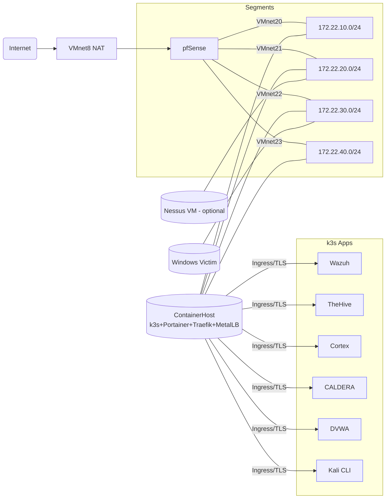

# SOC-9000

A pfSense-routed, k3s-managed SOC lab on VMware Workstation 17 Pro (Windows 11).

## Contents

- [Overview](#overview)
- [Quick Start](#quick-start)
- [Project Structure](#project-structure)
- [Documentation](#documentation)
- [Development](#development)
- [Appendix A — pfSense install walk-through](#appendix-a--pfsense-install-walk-through-exact-screens--menus)
- [Appendix B — 1-page printable quick-start](#appendix-b--1-page-printable-quick-start)

## Overview

### VMs

- pfSense (edge)
- ContainerHost (k3s + Portainer + Traefik + MetalLB)
- Windows victim
- optional Nessus VM

### Apps

- Wazuh
- TheHive
- Cortex
- CALDERA
- DVWA
- Kali (CLI)
- Nessus Essentials

## Quick Start

### New Modular Architecture (v1.0.0+)

The project now uses a **modular architecture** with reusable PowerShell modules and dedicated builder scripts:

```powershell
git clone <repo-url> E:\SOC-9000\SOC-9000
cd E:\SOC-9000\SOC-9000
Copy-Item .env.example .env  # Configure your paths

# Build all VMs (interactive menu or CLI)
.\setup-soc9000.ps1 -All -Verbose

# Or build selectively
.\setup-soc9000.ps1 -Ubuntu -Windows -Verbose

# Or build individual VMs
.\ubuntu-build.ps1 -Verbose
.\windows-build.ps1 -Verbose
```

**Available Commands:**
- `.\setup-soc9000.ps1` - Main orchestrator (interactive menu or CLI parameters)
- `.\ubuntu-build.ps1` - Build Ubuntu container host VM
- `.\windows-build.ps1` - Build Windows 11 victim VM
- `.\nessus-build.ps1` - Build Nessus VM (stub - manual setup required)
- `.\pfsense-build.ps1` - Build pfSense VM (stub - manual setup required)

**Key Features:**
- ✅ Modular PowerShell modules (`modules/SOC9000.*.psm1`)
- ✅ Centralized configuration (`config/soc9000.config.psd1`)
- ✅ Individual builder scripts at repo root
- ✅ Pester tests for all modules (`tests/`)
- ✅ Backwards compatibility via `legacy/build-packer.ps1`

See [MIGRATION.md](MIGRATION.md) for migration guide from older versions.

### Prerequisites

Before building, ensure you have:
- PowerShell 7.2+
- VMware Workstation 17+
- Packer
- kubectl
- Git
- WSL2 with Ubuntu

**Quick install:**
```powershell
.\scripts\setup\install-prereqs.ps1
```

### Network Setup

Configure VMware virtual networks:
```powershell
.\scripts\setup\configure-vmnet.ps1
.\scripts\utils\verify-networking.ps1
```

### Full Lab Deployment

End-to-end bring-up (VMs, k3s, apps, telemetry):
```powershell
.\scripts\utils\lab-up.ps1
.\scripts\utils\lab-status.ps1
```

## Project Structure

```
SOC-9000/
├── setup-soc9000.ps1           # Main orchestrator (interactive/CLI)
├── ubuntu-build.ps1             # Ubuntu container host builder
├── windows-build.ps1            # Windows 11 victim builder
├── nessus-build.ps1             # Nessus VM builder (stub)
├── pfsense-build.ps1            # pfSense VM builder (stub)
├── build.ps1                    # Build helper (linting + tests)
├── deploy.ps1                   # Deployment helper (validation + deploy)
│
├── modules/                     # PowerShell modules
│   ├── SOC9000.Utils.psm1       # Logging, validation, paths
│   ├── SOC9000.Utils.psd1       # Module manifest
│   ├── SOC9000.Build.psm1       # Packer/VMware helpers
│   ├── SOC9000.Build.psd1       # Module manifest
│   ├── SOC9000.Platform.psm1    # OS checks, prereqs
│   └── SOC9000.Platform.psd1    # Module manifest
│
├── config/                      # Configuration
│   └── soc9000.config.psd1      # Centralized settings
│
├── scripts/                     # Organized scripts
│   ├── setup/                   # Setup scripts
│   │   ├── install-prereqs.ps1
│   │   ├── download-isos.ps1
│   │   ├── configure-vmnet.ps1
│   │   ├── wsl-prepare.ps1
│   │   └── ...
│   ├── build/                   # Build scripts
│   │   ├── nessus-vm-build-and-config.ps1
│   │   ├── clean-packer-cache.ps1
│   │   └── ...
│   ├── deploy/                  # Deployment scripts
│   │   ├── apply-k8s.ps1
│   │   ├── wazuh-vendor-and-deploy.ps1
│   │   ├── vmrun-lib.ps1
│   │   └── ...
│   └── utils/                   # Utility scripts
│       ├── lab-up.ps1
│       ├── lab-down.ps1
│       ├── lab-status.ps1
│       └── ...
│
├── tests/                       # Pester tests
│   ├── SOC9000.Utils.Tests.ps1
│   ├── SOC9000.Build.Tests.ps1
│   ├── SOC9000.Platform.Tests.ps1
│   └── ...
│
├── legacy/                      # Backwards compatibility
│   └── build-packer.ps1         # Deprecation shim
│
├── packer/                      # Packer templates
├── ansible/                     # Ansible playbooks
├── k8s/                         # Kubernetes manifests
│
├── .gitignore                   # Comprehensive ignore rules
├── PSScriptAnalyzerSettings.psd1 # Code quality settings
├── README.md                    # This file
├── MIGRATION.md                 # Migration guide
└── REFACTORING-SUMMARY.md       # Refactoring documentation
```

`configure-vmnet.ps1` creates or updates VMnet8 and VMnet20–23 with the correct subnets. `verify-networking.ps1` performs quick assertions and reports success when adapters, services, and hosts entries look good.

During the bring-up process you will still perform a short manual pfSense install (Chunk 3); the scripts then auto‑configure it.

### URLs (after bring-up)

- <https://portainer.lab.local:9443>
- <https://wazuh.lab.local>
- <https://thehive.lab.local>
- <https://cortex.lab.local>
- <https://caldera.lab.local>
- <https://dvwa.lab.local>
- <https://nessus.lab.local:8834> (container or VM)

### Topology



## Development

### Code Quality

Run linting and tests before committing:
```powershell
.\build.ps1                # Run PSScriptAnalyzer + Pester tests
.\build.ps1 -Fix           # Auto-fix PSScriptAnalyzer issues
.\build.ps1 -SkipAnalyzer  # Run tests only
```

### Testing

```powershell
# Run all tests
Invoke-Pester .\tests\

# Run specific test suite
Invoke-Pester .\tests\SOC9000.Utils.Tests.ps1 -Output Detailed

# Run module tests only
Invoke-Pester .\tests\SOC9000.*.Tests.ps1
```

### Module Development

Modules are located in `modules/` with manifests (`.psd1`) and source (`.psm1`):
- **SOC9000.Utils** - Logging, validation, paths, retries
- **SOC9000.Build** - Packer/VMware build automation
- **SOC9000.Platform** - OS detection, prerequisites, installers

Import modules in your scripts:
```powershell
Import-Module (Join-Path $PSScriptRoot 'modules' 'SOC9000.Utils.psm1') -Force
```

### Configuration Priority

Configuration is loaded in this order:
1. Command-line parameters
2. Environment variables
3. `.env` file
4. `config/soc9000.config.psd1`
5. Hard-coded fallbacks

## Documentation

See [docs/00-prereqs.md](docs/00-prereqs.md) → `08-atomic-caldera-wazuh.md` for full documentation and [docs/releases.md](docs/releases.md) for guidance on GitHub releases.  The repo is chunked so you can run pieces or the whole thing.

## Appendix A — pfSense install walk-through (exact screens & menus)

Goal: create the pfSense VM, install, and enable SSH so the repo can auto-configure everything afterward.

### A. Create the VM (VMware Workstation 17 Pro)

Minimum hardware:

- 2 vCPU
- 2 GB RAM
- 20–40 GB disk
- Mount `pfsense.iso`

Add five NICs in this order:

1. ethernet0 → VMnet8 (WAN)
2. ethernet1 → VMnet20 (MGMT)
3. ethernet2 → VMnet21 (SOC)
4. ethernet3 → VMnet22 (VICTIM)
5. ethernet4 → VMnet23 (RED)

Tip: use `vmxnet3` for each NIC.

### B. Installer screens (console)

- Boot → Install pfSense
- Keymap → Accept default → Continue
- Partitioning → choose Auto (UFS) (or ZFS if you prefer) → Install
- Wait for files to copy → Reboot (eject ISO if prompted)

### C. First boot (console menu)

You’ll see the pfSense console menu (numbered options). Do this:

1. Option 14) Enable Secure Shell → Yes to enable SSH
2. When asked which user can SSH: select admin (or allow both admin/root)
3. Note the LAN IP shown in the banner.

Immediately after install, pfSense may show 192.168.1.1 on LAN.
Our automation reassigns LAN to 172.22.10.1 during the config import.

#### Credentials

- If the installer asked for a password, use what you set.
- If not: default is `admin` / `pfsense`.
- The repo expects `.env` → `PFSENSE_ADMIN_USER=admin`, `PFSENSE_ADMIN_PASS=...`.
- If your password differs, update `.env` before continuing.

### D. Continue the automation

Return to your PowerShell window (where `lab-up.ps1` paused) and press Enter.
The playbooks will SSH in, import config (interfaces, DHCP, rules, syslog),
and reboot pfSense automatically.

Expected final IPs:

- MGMT/LAN = 172.22.10.1
- SOC = 172.22.20.1
- VICTIM = 172.22.30.1
- RED = 172.22.40.1

## Appendix B — 1-page printable quick-start

Host: Windows 11 + VMware Workstation 17 Pro

### Once (tools)

```powershell
winget install Git.Git HashiCorp.Packer Kubernetes.kubectl Helm.Helm OpenSSL.Win64 -e
wsl --install -d Ubuntu-22.04
# In Ubuntu:
sudo apt update && sudo apt -y install ansible git jq curl
```

### Folders & ISOs

- `E:\SOC-9000\isos\` (ubuntu-22.04.iso, win11-eval.iso, pfsense.iso, [optional] nessus_latest_amd64.deb)
- `E:\SOC-9000\artifacts\`
- `E:\SOC-9000\temp\`

### VMware nets (host-only)

Use `scripts/configure-vmnet.ps1` to create or update the required host-only networks and `scripts/verify-networking.ps1` to confirm adapter and DHCP settings. The configuration script uses VMware's `vnetlib.exe` (or `vmnetcfg.exe`/`vmnetcfgcli.exe` when available) and falls back to launching **Virtual Network Editor** (`vmnetcfg.exe`) if automation fails:

- VMnet20 = 172.22.10.0/24 (MGMT)
- VMnet21 = 172.22.20.0/24 (SOC)
- VMnet22 = 172.22.30.0/24 (VICTIM)
- VMnet23 = 172.22.40.0/24 (RED)
- Keep VMnet8 = NAT (WAN).

### Repo & env

```powershell
git clone <repo-url> E:\SOC-9000\SOC-9000
cd E:\SOC-9000\SOC-9000
Copy-Item .env.example .env
# Edit .env to match your ISO filenames & network names if needed
```

### Bring everything up (will pause for pfSense install)

```powershell
pwsh -File .\scripts\lab-up.ps1
```

### pfSense (manual, 3 mins)

1. Create VM with 5 NICs: WAN→VMnet8, MGMT→VMnet20, SOC→VMnet21, VICTIM→VMnet22, RED→VMnet23
2. Install: Install pfSense → default keymap → Auto (UFS) → Reboot
3. Console menu: 14) Enable Secure Shell, allow admin, note LAN IP
4. Back in PowerShell: press Enter to continue

### Done → URLs

- Portainer <https://portainer.lab.local:9443>
- Wazuh <https://wazuh.lab.local>
- TheHive <https://thehive.lab.local>
- Cortex <https://cortex.lab.local>
- CALDERA <https://caldera.lab.local>
- DVWA <https://dvwa.lab.local>
- Nessus <https://nessus.lab.local:8834>

If names fail: run `scripts\hosts-refresh.ps1` as Admin.

### Nessus VM notes

- Set `NESSUS_ACTIVATION_CODE` in `.env` (or you'll be prompted during `scripts\nessus-vm-build-and-config.ps1`).
- Place the Nessus `.deb` in `ISO_DIR` (defaults to `.\isos`) and ensure `NESSUS_DEB` matches the filename.
- URL: <https://nessus.lab.local:8834> after deployment.


### TheHive ↔ Cortex (once)

1. Cortex: create Admin + API key
2. TheHive → Admin → Cortex → add `http://cortex.soc.svc:9001` + API key

### Check telemetry

- Wazuh: Agents → containerhost & victim-win should be connected
- pfSense logs query: `log.file.path:/var/log/pfsense/pfsense.log`

### Useful commands

- `pwsh -File scripts/lab-status.ps1`      # show IPs/URLs
- `pwsh -File scripts/backup-run.ps1`      # snapshot state + PV tarball (`E:\SOC-9000\backups`)
- `pwsh -File scripts/smoke-test.ps1`      # reachability check
- `pwsh -File scripts/reset-lab.ps1`       # soft reset (reapply apps)
- `pwsh -File scripts/reset-lab.ps1 -Hard` # also wipes PV data on ContainerHost
- `pwsh -File scripts/lab-down.ps1`        # stop VMs

