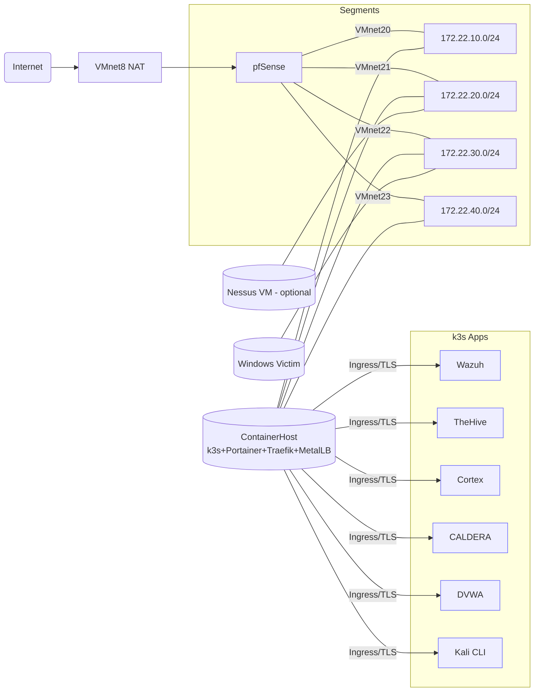

# SOC-9000

A pfSense-routed, k3s-managed SOC lab on VMware Workstation 17 Pro (Windows 11).

## Contents

- [Overview](#overview)
- [Quickstart](#quickstart)
- [Documentation](#documentation)
- [Appendix A — pfSense install walk-through](#appendix-a--pfsense-install-walk-through-exact-screens--menus)
- [Appendix B — 1-page printable quick-start](#appendix-b--1-page-printable-quick-start)

## Overview

### VMs

- pfSense (edge)
- ContainerHost (k3s + Portainer + Traefik + MetalLB)
- Windows victim
- optional Nessus VM

### Apps

- Wazuh
- TheHive
- Cortex
- CALDERA
- DVWA
- Kali (CLI)
- Nessus Essentials

## Quick Start

### Choose your installation path

SOC‑9000 offers three ways to get started, depending on your level of comfort with Git and PowerShell.  Use whichever fits your needs.

1. **One‑click installer (end‑user)** — Download a prebuilt `SOC-9000-installer.exe` from a GitHub release, right‑click and run it as Administrator.  The executable clones the repo into a separate folder (default `E:\SOC-9000-Pre-Install`), downloads required ISO images, updates `.env`, and runs the full bring‑up.  You don’t need to install Git or run Make yourself.
2. **Starter zip (no Git)** — Download `SOC-9000-starter.zip` from the release page.  Extract it to `E:\SOC-9000\SOC-9000`, open PowerShell as Administrator, and run:

   ```powershell
   # install prerequisites (GNU Make and PowerShell 7)
   make prereqs
   # download ISO images
   make download-isos
   # edit .env if needed
   make up-all
   ```

   This method is ideal if you don’t want to use Git but are comfortable running a few commands.
3. **Git clone (contributor/developer)** — If you plan to contribute or prefer to work directly with the source repository, clone it and run the Make targets yourself.  See below.

### Clone and initialize (contributor/developer path)

If you are contributing to SOC‑9000 and wish to clone the repository directly, run:

```powershell
git clone <repo-url> E:\SOC-9000\SOC-9000
cd E:\SOC-9000\SOC-9000
make init             # creates .env — edit it
make up-all           # end-to-end bring-up (VMs, k3s, apps, telemetry)
make status           # show IPs/URLs
```

Before building the installer EXE or running any other Make targets, ensure the required tools are installed:

```powershell
make prereqs          # installs GNU Make and PowerShell 7 if they are missing
```

You can then build the self‑contained installer executable via:

```powershell
make build-exe        # produces SOC-9000-installer.exe in the repo root
make package          # packages SOC-9000-starter.zip and SHA256SUMS.txt for releases
```

The `install-all` target combines prerequisite installation and EXE build in one step.

During `make up-all` you will still perform a short manual pfSense install (Chunk 3); the scripts then auto‑configure it.

### One‑click installation (end‑user path)

For a frictionless setup, download a release from GitHub (look for `SOC-9000-installer.exe`) or run the standalone installer script provided in this repo.  This will clone the repo into a separate directory (default `E:\SOC-9000-Pre-Install`), download the required ISO images, update the configuration paths and launch the entire bring‑up:

```powershell
# from within the cloned repo, build the installer executable
make build-exe

# then run it (or distribute it to others)
SOC-9000-installer.exe

# Alternatively, without building an exe, run the PowerShell installer directly
make installer
```

The standalone installer is ideal for end users who do not wish to learn Git or manage multiple folders.  It avoids confusion between the `SOC-9000` repo folder and the base lab directory by installing everything under `E:\SOC-9000-Pre-Install` (or a path of your choice).

### URLs (after `make up-all`)

- <https://portainer.lab.local:9443>
- <https://wazuh.lab.local>
- <https://thehive.lab.local>
- <https://cortex.lab.local>
- <https://caldera.lab.local>
- <https://dvwa.lab.local>
- <https://nessus.lab.local:8834> (container or VM)

### Topology



## Documentation

See [docs/00-prereqs.md](docs/00-prereqs.md) → `08-atomic-caldera-wazuh.md` for full documentation and [docs/releases.md](docs/releases.md) for guidance on GitHub releases.  The repo is chunked so you can run pieces or the whole thing.

## Appendix A — pfSense install walk-through (exact screens & menus)

Goal: create the pfSense VM, install, and enable SSH so the repo can auto-configure everything afterward.

### A. Create the VM (VMware Workstation 17 Pro)

Minimum hardware:

- 2 vCPU
- 2 GB RAM
- 20–40 GB disk
- Mount `pfsense.iso`

Add five NICs in this order:

1. ethernet0 → VMnet8 (WAN)
2. ethernet1 → VMnet20 (MGMT)
3. ethernet2 → VMnet21 (SOC)
4. ethernet3 → VMnet22 (VICTIM)
5. ethernet4 → VMnet23 (RED)

Tip: use `vmxnet3` for each NIC.

### B. Installer screens (console)

- Boot → Install pfSense
- Keymap → Accept default → Continue
- Partitioning → choose Auto (UFS) (or ZFS if you prefer) → Install
- Wait for files to copy → Reboot (eject ISO if prompted)

### C. First boot (console menu)

You’ll see the pfSense console menu (numbered options). Do this:

1. Option 14) Enable Secure Shell → Yes to enable SSH
2. When asked which user can SSH: select admin (or allow both admin/root)
3. Note the LAN IP shown in the banner.

Immediately after install, pfSense may show 192.168.1.1 on LAN.
Our automation reassigns LAN to 172.22.10.1 during the config import.

#### Credentials

- If the installer asked for a password, use what you set.
- If not: default is `admin` / `pfsense`.
- The repo expects `.env` → `PFSENSE_ADMIN_USER=admin`, `PFSENSE_ADMIN_PASS=...`.
- If your password differs, update `.env` before continuing.

### D. Continue the automation

Return to your PowerShell window (where `make up-all` paused) and press Enter.
The playbooks will SSH in, import config (interfaces, DHCP, rules, syslog),
and reboot pfSense automatically.

Expected final IPs:

- MGMT/LAN = 172.22.10.1
- SOC = 172.22.20.1
- VICTIM = 172.22.30.1
- RED = 172.22.40.1

## Appendix B — 1-page printable quick-start

Host: Windows 11 + VMware Workstation 17 Pro

### Once (tools)

```powershell
winget install Git.Git HashiCorp.Packer Kubernetes.kubectl Helm.Helm OpenSSL.Win64 -e
wsl --install -d Ubuntu-22.04
# In Ubuntu:
sudo apt update && sudo apt -y install ansible git jq curl
```

### Folders & ISOs

- `E:\SOC-9000\isos\` (ubuntu-22.04.iso, win11-eval.iso, pfsense.iso, [optional] nessus_latest_amd64.deb)
- `E:\SOC-9000\artifacts\`
- `E:\SOC-9000\temp\`

### VMware nets (host-only)

- VMnet20 = 172.22.10.0/24 (MGMT)
- VMnet21 = 172.22.20.0/24 (SOC)
- VMnet22 = 172.22.30.0/24 (VICTIM)
- VMnet23 = 172.22.40.0/24 (RED)
- Keep VMnet8 = NAT (WAN).

### Repo & env

```powershell
git clone <repo-url> E:\SOC-9000\SOC-9000
cd E:\SOC-9000\SOC-9000
make init
# Edit .env to match your ISO filenames & network names if needed
```

### Bring everything up (will pause for pfSense install)

```powershell
make up-all
```

### pfSense (manual, 3 mins)

1. Create VM with 5 NICs: WAN→VMnet8, MGMT→VMnet20, SOC→VMnet21, VICTIM→VMnet22, RED→VMnet23
2. Install: Install pfSense → default keymap → Auto (UFS) → Reboot
3. Console menu: 14) Enable Secure Shell, allow admin, note LAN IP
4. Back in PowerShell: press Enter to continue

### Done → URLs

- Portainer <https://portainer.lab.local:9443>
- Wazuh <https://wazuh.lab.local>
- TheHive <https://thehive.lab.local>
- Cortex <https://cortex.lab.local>
- CALDERA <https://caldera.lab.local>
- DVWA <https://dvwa.lab.local>
- Nessus <https://nessus.lab.local:8834>

If names fail: run `scripts\hosts-refresh.ps1` as Admin.

### TheHive ↔ Cortex (once)

1. Cortex: create Admin + API key
2. TheHive → Admin → Cortex → add `http://cortex.soc.svc:9001` + API key

### Check telemetry

- Wazuh: Agents → containerhost & victim-win should be connected
- pfSense logs query: `log.file.path:/var/log/pfsense/pfsense.log`

### Useful commands

- `make status`     # show IPs/URLs
- `make backup`     # snapshot state + PV tarball (`E:\SOC-9000\backups`)
- `make smoke`      # reachability check
- `make reset`      # soft reset (reapply apps)
- `make reset-hard` # also wipes PV data on ContainerHost
- `make down-all`   # stop VMs
